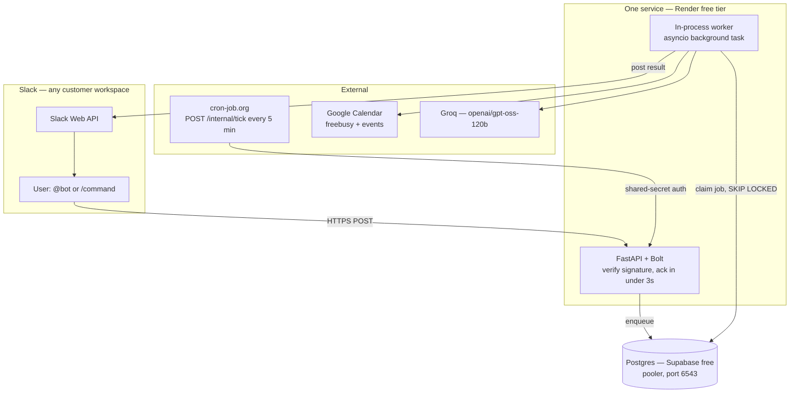
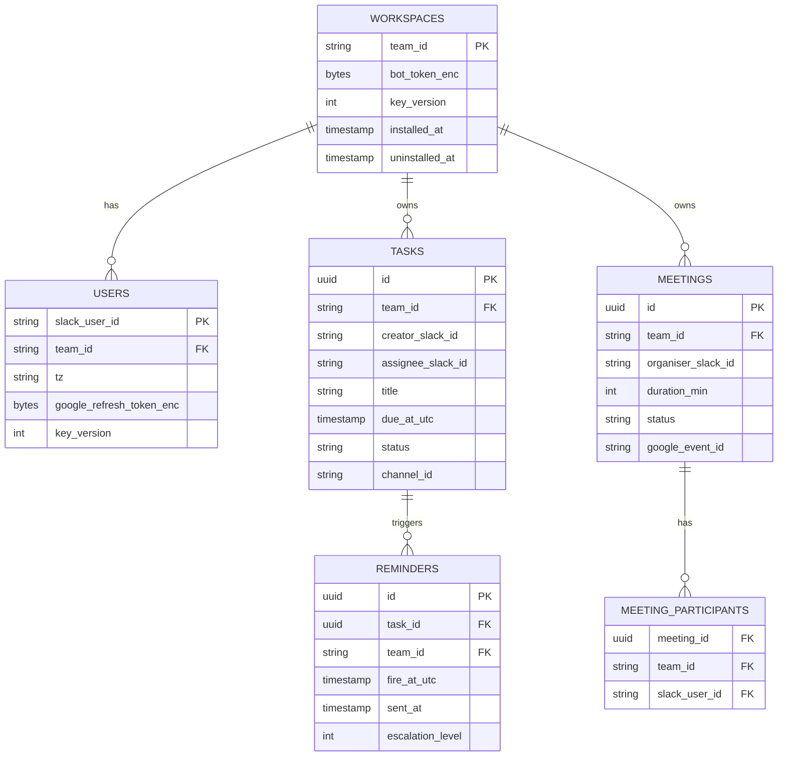

# Architecture

Read this before touching any code. It's the map — if you're an autonomous agent picking up a
task, you start every session with no memory of the last one, so this document has to carry the
context that a human teammate would otherwise give you verbally.

## What this is

A multi-tenant Slack bot: task/deadline tracking with automated chasing, and meeting scheduling
that reads participants' Google Calendars to find the earliest mutual free slot. Any Slack
workspace can install it via OAuth. Every external service in the stack is free-tier — there is
no budget for hosting, databases, or LLM inference beyond what's already free.

**Definition of done:** a stranger can install the bot into their own Slack workspace and use
tasks and reminders. A Google account we've explicitly allowlisted as a Test User can link a
calendar and book a meeting. Google's app verification (required before calendar linking opens
to strangers) is submitted, and the README states its real status.

## Non-negotiables

These constraints shape every decision below. Don't work around them without flagging it.

1. **Zero recurring spend.** No subscriptions, no cards on file, ever. Every service choice was
   picked to fit a free tier.
2. **`team_id` isolation is absolute.** One workspace must never see another's data. This is
   the single most serious class of bug this product could ship.
3. **The 3-second Slack ack rule.** Inbound Slack requests must get a `200` within 3 seconds or
   Slack retries the event (up to 3 times) and shows the user an error. Nothing slow happens
   inline.
4. **Tools before LLM.** Every capability is a real, testable, deterministic function first. The
   LLM is a thin router on top that picks which function to call — never the thing holding the
   logic.

## System shape

One web process, one database, one external heartbeat — not the three-process design (web /
worker / scheduler) you might expect from a textbook version of this. No free hosting tier runs
three always-on services, so the worker lives in-process behind an asyncio background task, and
an external cron tick replaces the scheduler process entirely.

**Ack-and-enqueue, always.** The web handler verifies the Slack signature, dedupes on
`event_id`, writes a row, and returns `200` — under 3 seconds, every time. The actual work
(calendar queries, LLM calls, Slack replies) happens afterward on the in-process worker, which
posts the result back as a *new* message rather than a synchronous reply.

**This applies to slash commands too, not just events** — and getting it wrong once already
cost a real bug. `/task` and `/link-calendar` are pure DB reads/writes with no network calls,
so answering inline within the request is correct. `/meet`'s propose path makes one real Google
API call *per participant*; it enqueues an `inbound_jobs` row (`event_type="meet_propose"`) and
acks immediately, and the worker's `handle_meet_propose` posts the real answer to Slack's
`response_url` once it's done (valid for 30 minutes after the original command). The first
version of `/meet` called Google synchronously inside the request handler — it worked in every
test because tests don't have Slack's 3-second clock running, and would have silently timed out
in production the first time someone proposed a meeting with more than one or two participants.
**Any new command that makes a network call needs to ask this question before it ships:** could
this exceed 3 seconds with a slow network or a few extra participants? If yes, enqueue it.

**The cron tick does two jobs with one mechanism.** It drains the reminders/jobs table (the
scheduler's job) and it keeps Render's free service from spinning down after 15 minutes of
idle, which would otherwise turn every cold request into a 30–60s stall that blows the 3-second
budget. Reminder precision is therefore ±5 minutes — acceptable for "your report is due
tomorrow", and stated as a real product property, not hidden as an implementation detail.

**Local dev needs a public HTTPS tunnel too, not just Socket Mode.** Socket Mode covers inbound
*events* without a public URL, but Slack's OAuth redirect URL must be HTTPS even in
development — Google exempts `http://localhost`, Slack does not. Run `ngrok http 8000` and
register that URL as the dev Slack app's OAuth redirect. Dev and prod are **separate Slack
apps** with separate redirect URIs — swapping one for the other is the most common cause of a
`redirect_uri_mismatch` error.

## The two OAuth flows

Two unrelated identity systems. A Slack user ID tells you nothing about someone's Google
account.

| | Slack OAuth | Google OAuth |
|---|---|---|
| Granted by | A workspace admin, once per organisation | Each individual person, separately |
| Yields | A bot token for the whole workspace | A refresh token for one person's calendar |
| Without it | Bot can't operate in that org | Bot can't see *that person's* availability — treated as a normal state, not an error |

Both flows use a `state` parameter that ties the OAuth callback back to whoever started it —
this is a real CSRF control, not a formality. Google's calendar scopes are **sensitive**
(`calendar.freebusy`, `calendar.events`), which means the consent screen stays in "Testing"
until Google verifies the app: refresh tokens expire after 7 days, and any Google account not
explicitly added as a Test User gets a hard `Access denied`. Build `invalid_grant` handling
(detect refresh failure, mark the link broken, prompt re-link) regardless of verification
status — tokens also die on password change and revocation.

## Data model

Plus two operational tables: `processed_events` (dedupe Slack retries by `event_id`) and
`oauth_states` (pending OAuth state with a TTL).

**Two rules enforced in the data-access layer, never left for a call site to remember:**

1. **Every query filters on `team_id`.** `REMINDERS` and `MEETING_PARTICIPANTS` carry `team_id`
   directly even though it's reachable via `task_id`/`meeting_id` — this is deliberate
   denormalisation so the tenant-scoped repository base class (`app/repositories/base.py`) can
   apply one uniform predicate to every table, and so Postgres Row-Level Security policies stay
   simple column checks instead of join-based `USING` clauses. Set it from the parent row on
   insert, in the same transaction.
2. **All timestamps are UTC**, rendered in the user's Slack-reported timezone at display time.

`creator_slack_id` exists because tasks can be assigned by anyone to anyone — when a task goes
overdue, the escalation also DMs whoever created it, and that's not derivable from
`assignee_slack_id` once assignment is open. `MEETING_PARTICIPANTS` holds 2–8 rows per meeting;
the availability-intersection function reads every row for a meeting, not a single organiser
field. Unit 4.6 (slot proposal + book-on-click) is what writes these rows.

## Security boundary

- **Every inbound Slack request is HMAC-verified** against the raw request body (never
  re-serialised JSON — that produces different bytes and silently breaks the check), with a
  5-minute timestamp window against replay, using constant-time comparison.
- **The LLM only ever picks a whitelisted, Pydantic-validated tool.** It never touches the
  database directly, never supplies its own `team_id` (the server injects it), and destructive
  actions require a human confirmation click. A prompt injection can make the model *choose*
  the wrong tool call; it can never expand what tools exist or what they're allowed to do.
- **Secrets are tiered.** App-level secrets (`SLACK_SIGNING_SECRET`, `GROQ_API_KEY`, etc.) live
  in environment variables. Per-tenant secrets (bot tokens, Google refresh tokens) are Fernet-
  encrypted at rest, with a `key_version` column on every encrypted row so a key can be rotated
  by re-encrypting gradually.

## Stack — every line of it free

| Need | Choice | Why |
|---|---|---|
| Hosting | **Render** free web service — exactly one, ever | 750 instance-hours/month per *workspace*, shared across every free service in the account. A 31-day month is 744 hours — a 6-hour margin. Spinning up a second free service for "just testing" can blow it |
| Database | **Supabase** free Postgres, via the **pooler on port 6543** | No compute-hour meter, pauses only after 7 days of inactivity. Direct connections (5432) are capped low on the free tier — an asyncio pool must go through Supavisor |
| Scheduler | **cron-job.org** free, POSTs `/internal/tick` every 5 min | Protected by `CRON_SHARED_SECRET` — it's a public endpoint by necessity |
| LLM | **Groq** free tier, model `openai/gpt-oss-120b` | 30 req/min, **1,000 req/day, 8,000 tokens/min** — the TPM figure is the binding constraint, keep tool schemas small. Chosen over Gemini because Groq doesn't train on inputs/outputs at any tier; Gemini's free tier may |
| Dev tunnel | **ngrok** free | One fixed dev domain per account, no session timeout. Shows a one-click interstitial on the OAuth redirect — an extra click, not a broken flow |

## Repository layout and ownership

Two file-disjoint tracks, so parallel work never merge-conflicts:

| Track | Directories |
|---|---|
| **Domain (Claude)** | `app/core/`, `app/models/`, `app/repositories/`, `app/services/`, `app/agent/`, `alembic/` |
| **Infrastructure (Devin)** | `tests/`, `.github/`, `app/ui/blocks/`, `app/observability/`, `Dockerfile`, `render.yaml` |

See `CONTRIBUTING.md` for the task template any autonomous agent should be given, and for what
never to touch without asking.
